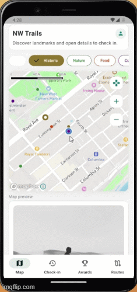

# NW Trails

NW Trails is a Flutter mobile app prototype for exploring landmarks in New Westminster.
It is built for the CSIS4280 Project 01 proposal/prototype milestone.

## Project Goal

Help users discover local landmarks, check in during visits, track progress, and follow curated walking routes.

## Current Status

- Repository and project structure are set up for team collaboration.
- UI/UX wireframe specifications are defined.
- Flutter app implementation is in early prototype stage.

## Demo Gif



## Demo Video

- YouTube: https://www.youtube.com/watch?v=6Hc2wNXTypo

## Planned MVP Features

- Landmark discovery on map and detail view
- Location-based check-in flow
- Awards/profile progress tracking
- Route list and route detail flow

## Tech Stack

- Flutter (Dart)
- Material Design
- Local stub/mock data for prototype stage

## Quick Start

```bash
flutter pub get
flutter run
```

Android-first run (recommended for this project):

```bash
flutter run -d android --dart-define=MAPBOX_ACCESS_TOKEN=<your_mapbox_public_token>
```

## Token Policy (For Team Testing)

- A Mapbox public token (`pk.*`) can be shared for class testing.
- Never share a secret token (`sk.*`).
- For safer sharing, set token restrictions in Mapbox dashboard (allowed apps/URLs/scopes) and rotate the token after grading.

## Standard Test Runbook (Android)

### 1) Prerequisites

```bash
flutter pub get
flutter analyze
flutter test
flutter build apk --debug
```

### 2) Start the app with token

Use your own local token file path (do not hardcode another teammate's local path).
Put your own token in the txt file.

PowerShell example:

```powershell
$token = (Get-Content '<path-to-your-token-file.txt>' -Raw).Trim()
flutter devices
flutter run -d <device-id> --dart-define=MAPBOX_ACCESS_TOKEN=$token
```

device id example: emulator-5554

### 3) Historic Downtown Walk route test (emulator)

Keep `flutter run` in one terminal. Open another terminal for ADB location injection.

If `adb` is already in `PATH`:

```powershell
adb -s <device-id> emu geo fix -122.9094 49.2064
adb -s <device-id> emu geo fix -122.9079 49.2060
adb -s <device-id> emu geo fix -122.9119 49.2070
adb -s <device-id> emu geo fix -122.9119 49.2046
adb -s <device-id> emu geo fix -122.9079 49.2058
```

If `adb` is not in `PATH`, use your local SDK path:

```powershell
<ANDROID_SDK_ROOT>\platform-tools\adb.exe -s <device-id> emu geo fix -122.9094 49.2064
<ANDROID_SDK_ROOT>\platform-tools\adb.exe -s <device-id> emu geo fix -122.9079 49.2060
<ANDROID_SDK_ROOT>\platform-tools\adb.exe -s <device-id> emu geo fix -122.9119 49.2070
<ANDROID_SDK_ROOT>\platform-tools\adb.exe -s <device-id> emu geo fix -122.9119 49.2046
<ANDROID_SDK_ROOT>\platform-tools\adb.exe -s <device-id> emu geo fix -122.9079 49.2058
```

```
<ANDROID_SDK_ROOT> example:
C:\Users\<your_username>\AppData\Local\Android\Sdk\
```

### 4) Expected behavior checklist

- Start route: `Historic Downtown Walk` (`l1 -> l2 -> l3 -> l4 -> l12`)
- Check-in succeeds when near the current stop
- `Next stop` advances only after a successful check-in
- `Go to next stop` returns to Map and focuses the next route stop
- Final stop check-in completes the route and clears active route
- Duplicate same-day check-in on same landmark is blocked (expected)

## Team Collaboration Workflow

### 1) Repository Access

Yes, add your teammates as GitHub collaborators for this private class repo.

- GitHub -> Settings -> Collaborators and teams -> Add people
- Give each teammate write access

### 2) Branch Strategy

- `main`: stable integration branch
- `feature/<name>-<task>`: each teammate works in a dedicated feature branch

Example:

```bash
git checkout -b feature/alice-checkin-ui
```

### 3) Pull Request Flow

1. Push feature branch
2. Open PR into `main`
3. At least one teammate reviews
4. Merge after checks and review

## Suggested Team Rules

- Keep commits focused and small
- Use clear commit messages (`feat:`, `fix:`, `docs:`)
- Run `flutter analyze` before opening PR
- Do not commit generated build artifacts

## Collaboration Templates

- Contribution guide: `CONTRIBUTING.md`
- PR template: `.github/pull_request_template.md`

## Team Sync Docs

- Docs index: `docs/README.md`
- Full proposal draft: `docs/group06-proposal-draft.md`
- Full UI/UX flow doc: `docs/ui_design_sequence_review.md`
- UI/UX sync snapshot: `docs/design/ui_ux_flow_sync.md`
- Proposal scope snapshot: `docs/proposal/proposal_scope_sync.md`
- lib file ownership map: `docs/development/lib_structure_and_ownership.md`
- Final submission checklist: `docs/final_submission_checklist.md`
