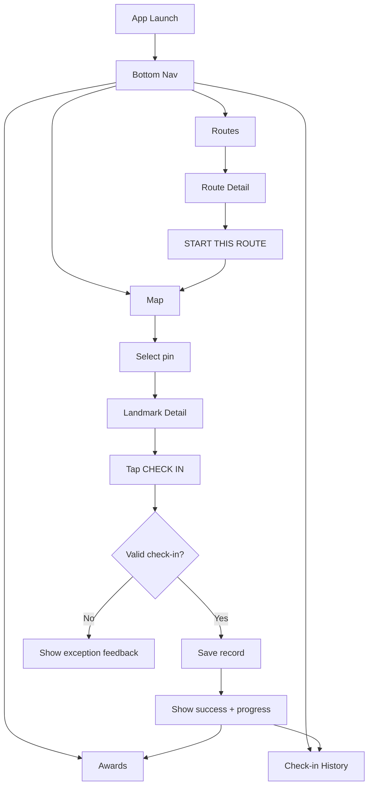
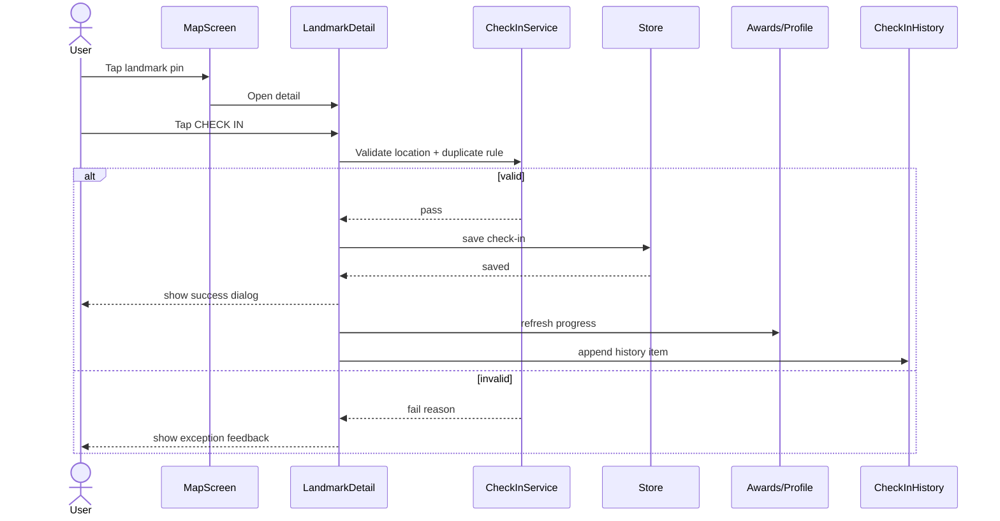
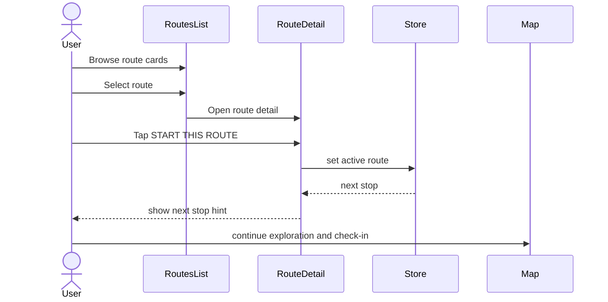

# NW Trails UI/UX Flow and Sequence Design

## 1) Information Architecture and Navigation Roles

| Navigation Entry | Role | UX Responsibility |
|---|---|---|
| Map | Primary destination | Landmark discovery, filter, pin selection, detail entry |
| Check-in | Primary destination | History and status hub (timeline, retry/failure visibility) |
| Awards | Primary destination | Progress feedback and badge motivation |
| Routes | Primary destination | Route browse, route detail, route start |
| Landmark Detail `CHECK IN` | Contextual action | The only entry point that creates a new check-in |

UI/UX rule:

- New check-in creation is only from Landmark Detail.
- Check-in tab is not an alternate creation entry; it is a history/status destination.

## 2) Screen-Level UI Definition

### P1 Home / Map

- AppBar with app identity and profile entry.
- Category chips for filtering.
- Map with landmark pins and current location.
- Bottom preview card for selected landmark.
- Bottom navigation for cross-feature movement.

Primary interactions:

- Tap pin -> show/update preview card.
- Tap preview card -> open Landmark Detail.

### P2 Landmark Detail + Check-in

- Back/bookmark actions.
- Image carousel.
- Landmark information block.
- About/practical information block.
- Sticky action area: `CHECK IN` and `GET DIRECTIONS`.
- Success dialog with progress update and next badge hint.

Primary interactions:

- Tap `CHECK IN` -> validate conditions -> create check-in -> show success feedback.
- Tap `GET DIRECTIONS` -> launch directions flow.

### P3 Achievements & Profile

- Profile header with current progress.
- Tier badges and theme badges with earned/locked states.
- Check-in history sorted by recency.

Primary interactions:

- Review progress change after successful check-in.
- Open history items for context traceability.

### P4 Routes (List + Detail)

- Routes list with difficulty filter and card metadata.
- Route detail with mini map, metadata bar, and stop timeline.
- `START THIS ROUTE` action for route activation.

Primary interactions:

- Tap route card -> route detail.
- Tap `START THIS ROUTE` -> set active route and return to exploration journey.

### P5 Community Leaderboard

- Community AppBar and Leaderboard/Heatmap tabs.
- Top ranking panel + ranked list with current user highlight.
- Personal stats and trending landmarks.

Primary interactions:

- Switch between community views.
- Browse trending landmarks for discovery cues.

## 3) Core User Sequences

### 3.1 Main Journey: Discover -> Check-in -> Progress

1. User enters Map and filters or browses pins.
2. User opens Landmark Detail from preview card.
3. User taps `CHECK IN`.
4. System validates location and duplication rules.
5. On success, check-in record is created.
6. Success dialog shows progress and next badge target.
7. Awards/Profile reflects updated progress; Check-in tab shows new history record.

### 3.2 Check-in History Journey

1. User opens Check-in tab from bottom navigation.
2. User reviews timeline and latest activity.
3. If previous save failed, user retries from status/hub context.
4. User returns to Map/Detail for the next check-in opportunity.

### 3.3 Route Journey

1. User opens Routes list.
2. User selects a route and reviews stops.
3. User taps `START THIS ROUTE`.
4. Active route context is set and next stop is emphasized.
5. User continues with Map + Detail + Check-in loop.

## 4) Exception-State UX (Design-Level)

Minimum exception states to visualize in wireframe flow:

- Out of range (`> 50m`): disable or block `CHECK IN` with distance reason.
- Permission denied: explain requirement and provide settings path.
- Duplicate same-day check-in: show already-checked-in feedback and history entry.

Additional exception handling that can remain annotation-level:

- Location service disabled.
- Save/retry failure from history/status hub.

## 5) UI/UX Flow Diagrams (Mermaid)

### 5.1 IA and Navigation Flow

### 5.2 Sequence: Check-in Flow

### 5.3 Sequence: Route Start and Continue

